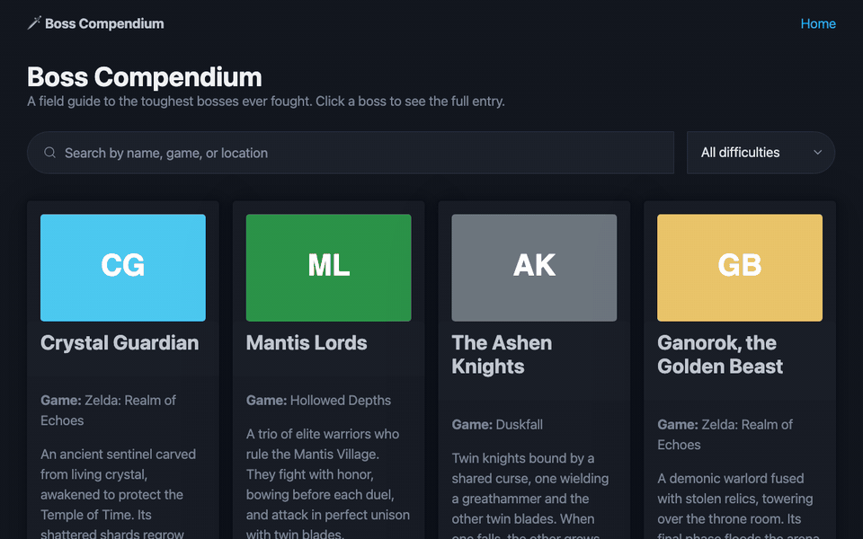

# Boss Compendium — Database Edition

Submitted by: **Adam Solomon**

**Boss Compendium** catalogs memorable video game bosses. This version refactors the Unit 1 listicle so every list item is stored in and served from a **Render PostgreSQL** database. The frontend is plain HTML, CSS and JavaScript that fetches data from the Express API.

Time spent: *3*_ hours**

## Required Features

The following **required** functionality is completed:

- [x] The web app uses only HTML, CSS, and JavaScript without a frontend framework
- [x] Data is supplied to the app using a Render PostgreSQL database
- [x] The web app is connected to a Render PostgreSQL database
- [x] The database contains an appropriately structured table for the list items

The following **optional** features are implemented:

- [x] Users can search for items with a specific attribute
  - Search box matches name, game, or location (`ILIKE`), and a dropdown filters by difficulty

The following **additional** features are implemented:

* [x] Unknown boss slugs return a real 404 page (checked against the database)
* [x] Color-coded difficulty badges, stored as a PostgreSQL `ENUM`

## Video Walkthrough

Here's a walkthrough of implemented required features:



The walkthrough shows the app running against the Render PostgreSQL database: the boss list loading, searching for "zelda", filtering by Legendary difficulty, opening a boss's detail page, and the 404 page for an unknown boss.

GIF created with a headless-Chrome recording script (Chrome DevTools Protocol) + `ffmpeg`.

## Project Structure

```
client/                 frontend (served statically by Express)
  index.html            list page
  boss.html             detail page
  404.html
  assets/               boss artwork
  css/style.css
  scripts/api.js        fetch helpers for the backend API
  scripts/bosses.js     renders the list + search
  scripts/boss.js       renders a single boss
server/
  server.js             Express server
  config/database.js    pg connection pool
  config/reset.js       creates + seeds the bosses table
  data/bosses.js        seed data
  routes/bosses.js      /api/bosses routes
  controllers/bosses.js SQL queries
```

## Database Schema

```sql
CREATE TYPE difficulty_level AS ENUM ('Easy', 'Medium', 'Hard', 'Legendary');

CREATE TABLE bosses (
  id          SERIAL PRIMARY KEY,
  slug        VARCHAR(50)  NOT NULL UNIQUE,
  name        VARCHAR(100) NOT NULL,
  game        VARCHAR(100) NOT NULL,
  description TEXT         NOT NULL,
  image       VARCHAR(255) NOT NULL,
  difficulty  difficulty_level NOT NULL,
  health      INTEGER      NOT NULL CHECK (health > 0),
  location    VARCHAR(150) NOT NULL,
  weakness    TEXT         NOT NULL
);
```

## API

| Method | Route | Description |
| ------ | ----- | ----------- |
| GET | `/api/bosses` | All bosses. Optional `?search=` and `?difficulty=` |
| GET | `/api/bosses/:slug` | One boss, or 404 |

## Setup

1. Create a PostgreSQL database on [Render](https://dashboard.render.com) (New → PostgreSQL).
2. Copy `server/.env.example` to `server/.env` and paste the **External Database URL** into `DATABASE_URL`.
3. Install dependencies, then create and seed the table:
   ```bash
   npm install
   npm run reset
   ```
4. Start the server and open http://localhost:3000:
   ```bash
   npm run dev
   ```

## License

    Copyright 2026 Adam Solomon

    Licensed under the Apache License, Version 2.0 (the "License");
    you may not use this file except in compliance with the License.
    You may obtain a copy of the License at

        http://www.apache.org/licenses/LICENSE-2.0

    Unless required by applicable law or agreed to in writing, software
    distributed under the License is distributed on an "AS IS" BASIS,
    WITHOUT WARRANTIES OR CONDITIONS OF ANY KIND, either express or implied.
    See the License for the specific language governing permissions and
    limitations under the License.
